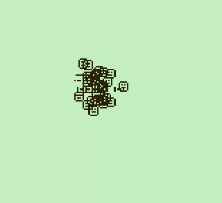
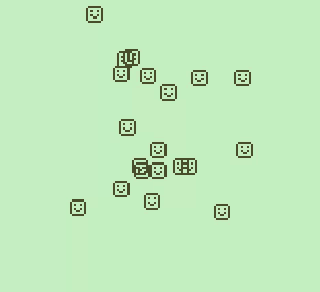
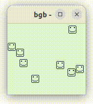
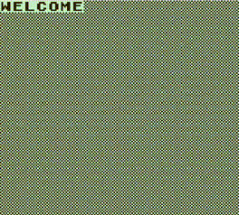

# Game Boy Computing Lab (GB Lab)

Teaching materials for learning computer architecture and assembly
programming on the Nintendo Game Boy.

* [Lab notes](labnotes.md)
* [Projects](projects.md)
* [Assessment](assessment.md)

## What the lab is

The lab aims to bridge the gap between high-level programming
and computer architecture.

The GB Lab teaches assembly programming during a semester, using
a subset of the Nintendo Game Boy (aka DMG) as a platform.

## Why the Game Boy

The Nintendo Game Boy is a small but complete computing platform.

Its CPU, memory map, graphics hardware and timing constraints are
simple enough to understand in a single semester, yet rich enough
to enable substantial programming projects.

Students learn assembly language on a real hardware platform with
modern tools and emulators.

The lab uses a simplified subset of the Game Boy to focus on
the fundamentals of machine-level programming and computer systems.

[See more in the instructor's notes.](instructor.md)

## Learning Objectives

By the end of the lab, students should be able to:

* Write programs in assembly language for the SM83 CPU.
* Understand the stored-program model of computation.
* Work directly with CPU registers, flags, memory and instructions.
* Implement control flow, data structures and functions in assembly.
* Analyze instruction timing.
* Understand timing constraints between CPU and graphic hardware.
* Develop graphics applications using tiles, sprites, and background maps.
* Design and implement a Game Boy project in assembly language.

## Screenshots

* Random walk

* Random walk with smooth moves

* Metaobjects

* Maze game

## Author

Guillaume Hoffmann <guillaumh@gmail.com>
