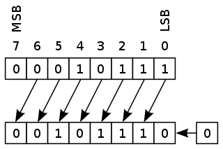
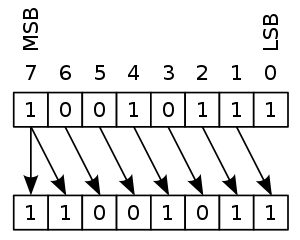

# Assembly Programming

## The Game Boy CPU

SM83: The Game Boy CPU

  * a custom CPU made by Sharp (Japan)
  * it imitates closely two existing popular CPUs:
    * Intel 8080: used in personal computers, the precursor of the x86 family still in use today
    * Zilog Z80: used in many personal computers of the 1970s and 1980s, and pocket calculators

## Instructions and instructions set

* Instructions are used to control a CPU
* Each instruction causes the CPU to perform a very specific task
* Each CPU has its own instruction set, that is a fixed set of instructions
  that it can understand.
* A program in machine code consists of a sequence of machine instructions
  and will only work on a specific CPU model

---

~~~
                        CPU
                 +--------------+
                 |              |
instructions ->  |   internal   |
                 |    state     |
                 |              |
                 +--------------+
~~~

--- 

~~~
                        CPU
                 +--------------+
                 |   8-bit      |
instructions ->  |  registers   |
                 |              | 
                 | a,b,c,d,e,h,l|
                 +--------------+
~~~

---

~~~
                        CPU
...              +--------------+
instr1           |   8-bit      |
instr2       ->  |  registers   |
instr3           |              | 
...              | a,b,c,d,e,h,l|
                 +--------------+
~~~

* What are registers?
  * each register == 8 bits
  * think of them as C variables char/uint8
  * cannot add more registers
  * `a` is often called the "accumulator"
* What are instructions?
  * small commands that tell the CPU to do something
  * very simple syntax

## Assembly language (ASM)

* ASM == writing programs as a sequence of instructions
* almost no syntax!
* instructions are very different from C statements
  * there are infinitely many C statements
  * there are finitely many ASM instructions

For instance, the following snippet in C:

~~~C
a = 20;
b = 40;
c = 50;
d = (a + b) + c;
~~~

Would be (almost) equivalent to the following ASM code:

~~~gnuassembler
ld a,20
ld b,40
ld c,50
add b
add c
ld d,a
~~~

## ASM syntax

~~~gnuassembler
ld a,10           ; decimal notation
ld b,20
add b             ; a = a + b
ld b,a
ld a,%00001111    ; binary notation
ld c,%11000000
or c              ; a = a | c
ld c,$F0          ; hexadecimal notation
xor c             ; a = a ^ c
~~~

|Format type|Prefix|Accepted characters |
|-----------|------|--------------------|
|Hexadecimal| `$`  | `0123456789ABCDEF` |
|Decimal    | none |  `0123456789`      |
|Binary     |  `%` |   `01`             |

* A numerical constant is also called an "immediate" in assembly.
* The syntax is line-based, meaning that you do one instruction per line.
* Uppercase/lowercase does not matter

## Our First Instructions

We will cover part of the following:

* 8-bit load instructions
* 8-bit arithmetic and logic instructions
* arithmetic shift instructions

Then do a few exercises.

## 8-bit load instructions

    Mnemonic         Description
    ---------------  ------------
    ld r,r           r=r
    ld r,n           r=n

  * r is one of the registers `a,b,c,d,e,h,l`
  * n is a 1 byte constant
  * examples:
    * `ld a,b`
    * `ld b,a`
    * `ld b,10`
    * `ld b,%00001010`  (equivalent to previous one)
    * `ld h,l`

## increment/decrement instructions

    Mnemonic     Description
    ------------ ------------------
    inc r        r=r+1
    dec r        r=r-1

  * examples:
    * `inc a`
    * `inc b`
    * `inc c`
    * `dec d`
    * `dec e`
    * `dec h`...

## 8-bit arithmetic instructions with register or constant arguments

    Mnemonic     Description
    ------------ ------------------
    add r        A=A+r
    add n        A=A+n
    sub r        A=A-r
    sub n        A=A-n

  * `a` is always the first argument of these instructions
  * `a` is also called the "accumulator"
  * in some documentation, they are written with `a` as first argument:
    * `add a,b`
    * `sub a,c`
  * the Game Boy CPU has no multiply and divide instructions

## 8-bit logic instructions with register or constant arguments

    Mnemonic     Description
    ------------ ------------------
    and r        A=A & r
    and n        A=A & n
    xor r        A=A ^ r
    xor n        A=A ^ n
    or r         A=A | r
    or n         A=A | n
    cpl          A = A xor FF (invert all bits of A)

## Arithmetic Shift instructions

    Mnemonic   Description
    ---------  ------------------------------
    sla r      shift left arithmetic (b0=0)
    sra r      shift right arithmetic (b7=b7)

`sla:` {width=4cm} `sra:` {width=3cm}

## Exercise 1

What are the final values of all registers of this snippet?

~~~gnuassembler
LD A,0
LD B,0
INC A
INC B
ADD B
LD C,A
LD D,10
ADD D
~~~

You can write the answer in the most convenient way (decimal, binary or hexa).

When writing answer in decimal, use the most convenient way between unsigned and signed.

E.g., `-128` and `128` have the same representation as vector of 8 bits; same for `-1` and `255`.

## Exercise 2

What are the final values of all registers of this snippet?

~~~gnuassembler
LD A,100
LD B,50
LD C,20
SUB B
SUB C
SUB C
DEC B
INC C
~~~

## Exercise 3

~~~gnuassembler
LD A,0
LD B,255
DEC A
INC B
~~~

A,B?

~~~gnuassembler
LD A,100
LD B,100
ADD B
ADD B
~~~

A,B?

~~~gnuassembler
LD A,100
LD B,100
SUB B
SUB B
~~~

A,B?

## Exercise 4

~~~gnuassembler
LD A,%00000000
LD B,%10101010
OR B
~~~

A, B?

~~~gnuassembler
LD A,%00001111
LD B,%10101010
OR B
~~~

A, B?

~~~gnuassembler
LD A,%00001111
LD B,%10101010
AND B
~~~

A,B?

## Exercise 5

~~~gnuassembler
LD A,$0F
LD B,$AA
XOR B
~~~

A,B?

~~~gnuassembler
LD A,$0F
LD B,$BB
CPL
LD B,A
~~~

A,B?
