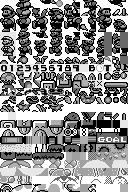
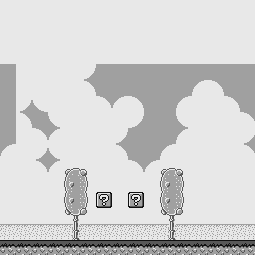
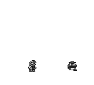
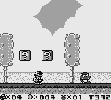
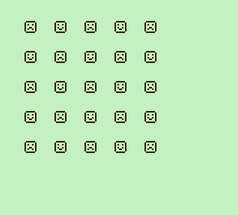

# Graphic Rendering

## Topics of this Section

  * Graphic rendering with the PPU
  * Initializing Graphic Data

## Program Study: `oam.asm`

* Download [`oam.asm`](asm/oam.asm).
* Copy and paste the contents of `oam.asm` into
  the `main.asm` file of <https://gbdev.io/rgbds-live/>
  to run it.
  
* Alternatively, you can download both `oam.asm` and `hardware.inc`
  and build it, run:

~~~bash
$ rgbasm  oam.asm -o oam.o
$ rgblink oam.o -o oam.gb
$ rgbfix -v -p 0 oam.gb
~~~

Then open `oam.gb` with an emulator (BGB or Emulicious).

## Hardware of the Game Boy: CPU and PPU

  * CPU and PPU are two circuits in the Gameboy that run in parallel.
    * PPU: Picture (or Pixel) Processing Unit
  * The picture is displayed on the LCD screen,
    has a resolution of 160×144 pixels and shows 4 shades of grey.
  * PPU draws on the LCD screen at 60 Hz.
  * PPU is connected to VRAM (Video RAM, 8 KBytes),
    and OAM (Object Attribute Memory, 160 Bytes); but not to the ROM or WRAM.
  * CPU is also connected to VRAM and OAM but can only access them when PPU is
    not busy with them.
  * Finally, CPU is connected to PPU and can control it to some extent.

## Graphic Elements: Tiles

  * Tiles are the basic ingredient for rendering graphics.
  * A tile is a 8x8 matrix of pixels.
    * Each pixel corresponds to one of the four colors (shades of grey).
  * Tiles are stored at the beginning of the VRAM.
  * We refer to each tile by its Tile ID, its position from the beginning of the VRAM,
    starting at ID 0.

## Graphic Elements: Background Layer

  * The Background layer is a matrix of tile IDs.
  * We will come back to the background layer in a few weeks.

## Graphic Elements: Objects

  * Objects are tiles that can move independently on the screen.
  * The maximum number of objects on screen is 40.
  * The Object Attribute Memory (OAM) is an array of 40 elements of 4 bytes each:
    * Y and X coordinates
    * Tile ID
    * Attributes (or Flags): palette, flip vertically, flip horizontally, etc.

## Constructing the Frame

  * PPU gets all the useful data from the VRAM and OAM.
  * For now, we will concentrate on the object layer only.

## Memory Map (Updated)

Address            Size        Description                   Access           Constant
-----------------  ---------   -----------------             -----------      -----------
\$0000-\$7FFF      32 KB       Game ROM                      Read-only
**\$8000-\$9FFF**  **8 KB**    **Video RAM**                 **Read-write**   `STARTOF(VRAM)`
$C000-\$DFFF       8 KB        Work RAM                      Read-write       `STARTOF(WRAM0)`
**\$FE00-\$FE9F**  **160 B**   **OAM**                       **Read-write**   `STARTOF(OAM)`
**\$FF40**         **1 B**     **LCD Control Register**      **Read-write**   `rLCDC`

  * Constants are defined in `hardware.inc`
  * Video RAM and OAM are acessible by the CPU when:
    1. PPU is turned off (typically at beginning of program)
    2. during VBlank (typically during normal function of program)

## Turning off the PPU

~~~gnuassembler
  call WaitVBlank
  ld a, 0
  ld [rLCDC], a
  ...

WaitVBlank:
  ld a, [rLY]
  cp 144
  jr nz, WaitVBlank
  ret
~~~   

  * When PPU is off, CPU has access to VRAM as long
    as it wishes.
  * This allows to copy graphical elements to Video RAM and initializing the OAM.

## Copying tiles from ROM to Video RAM

~~~gnuassembler
CopyTileDataToVRAM:
  ld de, Tiles
  ld hl, STARTOF(VRAM)
  ld bc, TilesEnd - Tiles
.copy:
  ld a,[de]
  inc de
  ld [hl],a
  inc hl
  ld [hl],a
  inc hl
  dec bc
  ld a,b
  or c
  jr nz, .copy
  ret

SECTION "TilesData", ROM0

Tiles:
; Tile ID 0: smiling face
 DB %01111110
 DB %10000001
 DB %10100101
 DB %10000001
 DB %10100101
 DB %10011001
 DB %10000001
 DB %01111110
TilesEnd:
~~~

## Preparing the OAM

  * Object Attribute Memory (OAM) is an array of 40 elements, each of 4 bytes:
    * Y position
      * Y = object vertical position on screen + 16
      * Y = 0 or Y >= 160: completely off-screen
    * X position
      * X = object horizontal position on screen + 8.
      * X = 0 or X >= 168: completely off-screen
    * Tile ID: choose the actual tile to display
    * Attributes: will leave it 0 for now
  * Setting the Y coordinate to 0 hides the object from screen.

~~~gnuassembler
ResetOAM:
  ld hl, STARTOF(OAM)
  ld b,40*4
  ld a,0
.loop:
  ld [hl],a
  inc hl
  dec b
  jr nz,.loop
  ret
~~~

## Preparing the Object Palette

~~~gnuassembler
  ld a,%11111100 ; set a black and white palette
  ld [rOBP0], a
~~~

  * Palette is a byte that assigns a screen color to each possible tile pixel value.
  * Any non-zero value is drawn as black.
  * Game Boy can display 4 levels of grey but we will stick to black and white only.
  * Simplifies our graphic data.

## Turning the PPU on again

~~~gnuassembler
  ld a, LCDC_ON | LCDC_OBJ_ON
  ld [rLCDC], a
~~~

  * `rLCDC` is loaded with a byte.
  * Each bit of that byte has a meaning.
  * `LCDC_ON` turns the PPU on
  * `LCDC_OBJ_ON` turns the object layer on
  * `LCDC_BG_ON` turns the background layer on (not used here)

## Putting it together

~~~gnuassembler
EntryPoint:
  call WaitVBlank
  ld a,0
  ld [rLCDC],a
  call CopyTileDataToVRAM
  call ResetOAM

  ld hl,STARTOF(OAM) ; hl points to first object entry
  ld [hl], 50        ; Y coordinate
  inc hl
  ld [hl], 70        ; X coordinate

  ld a,%11111100
  ld [rOBP0], a

  ld a, LCDC_ON | LCDC_OBJ_ON
  ld [rLCDC], a

MainLoop:
  jp MainLoop
~~~

## Exercise

Download the program `oam.asm` and solve the two series of exercises.

The result of the last exercise of the first series should look like:

## Resources

  * RGBDS: <https://rgbds.gbdev.io>
    * Install instructions are available on Moodle page.
  * `hardware.inc` <https://github.com/gbdev/hardware.inc>
  * Emulators:
    * BGB: <https://bgb.bircd.org/>. Only a Windows executable
      is provided, so [wine](https://www.winehq.org/) is necessary
      to execute it on Linux or Mac OS.
    * Emulicious: <https://emulicious.net/>

