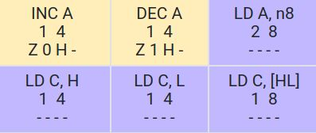
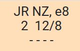
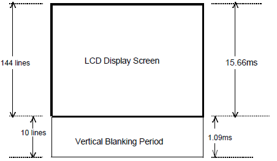

# Timing: CPU Cycles and VBlank

## Topics of this Section

  * Instructions timing
  * Vertical Blank
  * Random Walk

## Instructions timing

* We know that instruction table shows instruction size (left), in bytes.
* It also shows  instruction timing (right).
  Timing is expressed as clock cycles.

In general:

* Each memory access requires 4 cycles
* Bigger instructions take longer

## Calculating the timing of some code

* Without loops:
  * total is the sum of the timing of each instruction
* With loops:
  * count how many time the loop body repeats
  * in last loop body execution, jump is not taken
  * total = (\# loop repeats) \* (body + jump instruction times) - (difference between jump taken and jump not taken)

## Example

~~~asm
ResetMemory:
; inputs: HL: memory location
;         B>0: how many bytes to reset
  ld a,0  ; 8
.loop:
  ld [hl],a  ; 8
  inc hl     ; 8
  dec b      ; 4
  jr nz,.loop ; 12/8
  ret  ; 16
~~~

## Vertical Blank

Let us complete the Game Boy memory map:

Address            Size        Description                   Access           Constant
-----------------  ---------   -----------------             -----------      -----------
\$0000-\$7FFF      32 KB       Game ROM                      Read-only
\$8000-\$9FFF      8 KB        Video RAM                     Read-write       `STARTOF(VRAM)`
$C000-\$DFFF       8 KB        Work RAM                      Read-write       `STARTOF(WRAM0)`
\$FE00-\$FE9F      160 B       OAM                           Read-write       `STARTOF(OAM)`
\$FF40             1 B         LCD Control Register          Read-write       `rLCDC`
**\$FF44**         **1 B**     **LCD Y Coordinate Register** **Read-only**    `rLY`

  * `rLY` contains the current row being rendered on the LCD by PPU
    * Value increments from 0 to 153 and repeats.
    * 0->143: the current frame is being drawn (144 rows)
    * 144->153: Vertical Blank (VBlank), a short pause between two frames (10 "fake" rows)
    * Each row takes 456 cycles to draw
  * Video RAM and OAM are acessible by the CPU when:
    1. PPU is turned off (typically at beginning of program)
    2. during VBlank (typically during normal function of program)

## Example: a single object with movement

  * What if we want an object to move between each frame?
  * When PPU is ON, the OAM is only accessible by CPU during VBlank
  * The Main Loop would become:

~~~gnuassembler
MainLoop:
  call WaitVBlank
  ld   hl, START(OAM)
  inc  [hl]         ; increment Y
  inc  hl
  inc  [hl]         ; increment X
  ; TODO: we should do something for at least 456 cycles (why?)
  jp   MainLoop
~~~

## Program Study: Random Walk

Download [`walk1.asm`](asm/walk1.asm).

The program contains a constant `OBJCOUNT` that controls how many
objects to show on screen. It can be modified to any value from 1
to 40.

At each VBlank, it makes one of the objects randomly step into
one direction. Objects are selected in loop from the beginning
to the end of the OAM, only one per frame.

The challenge is: is it possible to make *all* objects randomly
step during each frame? Even if `OBJCOUNT` is 40?

The answer is *yes*, but we must be careful about timing.

## VBlank: Your Tight Deadline

* 4560 cycles = your entire budget per frame
* Miss it = visual glitches
* An acceptable program only modifies OAM and VRAM during VBlank
* The hardware does not wait for you!

## Doing the Random Walk for All Objects Per Frame

We could try to do:

~~~gnuassembler
MainLoop:
  call WaitVBlank
  [calculate and update the 40 objects coordinates in OAM]
  jp MainLoop
~~~

Estimate how many cycles the whole "calculate and update" section
would take.

Notice that this exceeds greatly the VBlank time. So a better
strategy is to do the following:

~~~gnuassembler
MainLoop:
  [calculate and update the 40 objects' new coordinates in WRAM]
  call WaitVBlank
  [copy all objects coordinates from WRAM to OAM]
  jp MainLoop
~~~

To do so, we must declare a "Shadow OAM" in WRAM:

~~~gnuassembler
SECTION "Variables", WRAM0
shadowOAM: DS 160 ; same size as OAM
~~~

Now the challenge is to copy the Shadow OAM to the real OAM during VBlank.

## Naive Copy

~~~gnuassembler
CopyShadowOAMtoOAM:
 ld hl, ShadowOAM
 ld de, STARTOF(OAM)
 ld b, OBJCOUNT*4
.loop:
  ld a,[hl]
  ld [de],a
  inc hl
  inc de
  dec b
  jr nz, .loop
  ret
~~~

This gives time only up to `OBJCOUNT = 23`.

Let us try to improve that.

## Load from/to memory with post-increment

    Mnemonic      Description
    ------------  -------------------------------
    ld [HL+],A    [HL]=A, HL=HL+1
    ld A,[HL+]    A=[HL], HL=HL+1
    ld [HL-],A    [HL]=A, HL=HL-1
    ld A,[HL-]    A=[HL], HL=HL-1

Also written as: `ld [hli], a`, `ld [hld],a`, etc.

Save 8 cycles over using `ld [hl],a` followed by `inc hl`.

## A Faster Copy

~~~gnuassembler
CopyShadowOAMtoOAM:
 ld hl, ShadowOAM
 ld de, STARTOF(OAM)
 ld b, OBJCOUNT*4
.loop:
  ld a,[hl+]
  ld [de],a
  inc e
  dec b
  jr nz, .loop
  ret
~~~

* OAM fits in the memory page `$FE00`, so we know value of
  register `d` will not change.
  * Increment `e` only
  * Save 4 cycles
* New timing:
  * total = 44 + 24 + (144 \* OBJCOUNT)
  * can handle up to: OBJCOUNT = 31
* Better but still not 40.

## Idea: Loop Unrolling

~~~gnuassembler
Function:
  ld b, X
.loop:
  [loop body]
  dec b
  jr nz, .loop
  ret

Function_Unrolled:
  ld b, X/2
.loop:
  [loop body]
  [loop body]
  dec b
  jr nz, .loop
  ret
~~~

## Function: `CopyShadowOAMtoOAM`

~~~gnuassembler
CopyShadowOAMtoOAM:
  ld hl, ShadowOAM
  ld de, STARTOF(OAM)
  ld b, OBJCOUNT
.loop:
  ld a,[hl+]
  ld [de],a
  inc e
  ld a,[hl+]
  ld [de],a
  inc e
  ld a,[hl+]
  ld [de],a
  inc e
  ld a,[hl+]
  ld [de],a
  inc e
  dec b
  jr nz, .loop
  ret
~~~ 

* 4 bytes are copied in a single loop repeat
* New timing: 44 + 24 + 96 \* OBJCOUNT
* VBlank is 4560 cycles
* max OBJCOUNT = 46
* For 40 objects, we would use 3908 cycles and still have 652 cycles to spare

## Extreme Solution: Completely Unroll the Loop

~~~gnuassembler
CopyShadowOAMtoOAM:
  ld hl, ShadowOAM
  ld de, STARTOF(OAM)
REPT 160
  ld a,[hl+]
  ld [de],a
  inc e
ENDR
  ret
~~~

* Size: 487 bytes instead of 24 bytes for the previous function
* New timing:
  * 40 + 20 \* 160 = 3240 cycles
  * VBlank is 4560 cycles
  * This leaves 1320 cycles to spare during VBlank.
* Loop unrolling is a space/time tradeoff.

## Function: `RandomByte`

  * There is no real source of randomness on the GameBoy, but
    let us try to write a "good enough" function anyway.
  * We can mix register values that change between different
    calls. `xor` operation is a good way to mix values
    (preserves 50%/50% distribution of 0's and 1's).
  * `rDIV` is a hardware counter that increments
    every 256 clock cycles.

~~~gnuassembler
RandomByte:
  ld a,[rDIV]
  xor b
  xor l
  xor [hl]
  ret
~~~

## Update State (Once per Frame)

~~~gnuassembler
UpdateObjects:
  ld hl,ShadowOAM
  ld b, OBJCOUNT
.loop
  push hl
  call RandomByte
  and %00000011
  jr z, .left
  cp 1
  jr z, .up
  cp 2
  jr z, .right
.down
  inc [hl]
  jr .next
.left
  inc hl
  dec [hl]
  jr .next
.up
  dec [hl]
  jr .next
.right
  inc hl
  inc [hl]
.next
  pop hl
  inc hl
  inc hl
  inc hl
  inc hl
  dec b
  jr nz, .loop
  ret
~~~

## Exercise

* Download the program `walk1.asm` and modify it so that we see
  40 objects randomly moving on screen, all doing one step per
  frame.
* Ensure the main loop looks like:

~~~gnuassembler
MainLoop:
  call UpdateObjects
  call WaitVBlank
  call CopyShadowOAMtoOAM
  jp MainLoop
~~~

