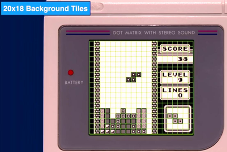
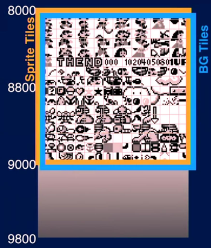
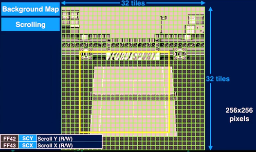
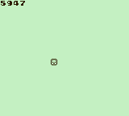
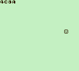
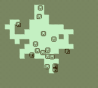
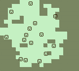

# Background Tilemaps

## Topics of this Section

* Enabling background layer (LCDC)
* Background tilemap structure (32x32)
* Real-time BG update in VBlank
* Coordinate display (hex conversion)
* Object to BG coordinates conversion (fog of war)

## Enabling the Background Layer

When turning on the PPU:

~~~gnuassembler
  ld a, LCDC_ON | LCDC_OBJ_ON | LCDC_BG_ON | LCDC_BLOCK01
  ld [rLCDC], a   
~~~

  * `LCDC_ON`: enable display
  * `LCDC_OBJ_ON`: enable object (OBJ) layer
  * `LCDC_BG_ON`: enable background (BG) layer
  * `LCDC_BLOCK01`: Use same Tile IDs for BG and OBJ
    (starting at `STARTOF(VRAM)`)

## Background Tilemap Basics

  * The background is a matrix of 32 * 32 tiles (also called tilemap)
  * Size: 1024 bytes (32 rows, 32 columns, one tile ID per cell)
  * Background is stored in VRAM at `TILEMAP0` address
  * The screen does not show the complete background, only 18 * 20 tiles
  * The screen viewpoint can move around by using registers `[rSCX]`
    and `[rSCY]` (scroll registers)

<!--

## LCDC bit 3

  * The PPU renders the background from one of two possible memory addresses
  * LCDC bit 3:
    * If 0: `9800-9BFF` (constant `TILEMAP0` )
    * If 1: `9C00-9FFF` (constant `TILEMAP1` )
  * Change this bit to quickly switch between two backgrounds.

 -->

## Today's Exercises

The two exercises are based on the random walk program.
They can be done independently or combined.
The exercises are:

* Print an object's coordinates on screen
* Fog of war

## Exercise: Display Object Coordinates in Background

The objective is to modify the Random Walk program so that it
shows in hexadecimal the `(y,x)` coordinates of the first object
at the top left corner of the screen.

You will need to add the following new tiles to the program:

~~~gnuassembler
 DB $00,$3C,$66,$66,$66,$66,$3C,$00 ; 0
 DB $00,$18,$38,$18,$18,$18,$3C,$00 ; 1
 DB $00,$3C,$4E,$0E,$3C,$70,$7E,$00 ; 2
 DB $00,$7C,$0E,$3C,$0E,$0E,$7C,$00 ; 3
 DB $00,$3C,$6C,$4C,$4E,$7E,$0C,$00 ; 4
 DB $00,$7C,$60,$7C,$0E,$4E,$3C,$00 ; 5
 DB $00,$3C,$60,$7C,$66,$66,$3C,$00 ; 6
 DB $00,$7E,$06,$0C,$18,$38,$38,$00 ; 7
 DB $00,$3C,$4E,$3C,$4E,$4E,$3C,$00 ; 8
 DB $00,$3C,$4E,$4E,$3E,$0E,$3C,$00 ; 9
 DB $00,$3C,$4E,$4E,$7E,$4E,$4E,$00 ; A
 DB $00,$7C,$66,$7C,$66,$66,$7C,$00 ; B
 DB $00,$3C,$66,$60,$60,$66,$3C,$00 ; C
 DB $00,$7C,$4E,$4E,$4E,$4E,$7C,$00 ; D
 DB $00,$7E,$60,$7C,$60,$60,$7E,$00 ; E
 DB $00,$7E,$60,$60,$7C,$60,$60,$00 ; F
~~~

Also, if A contains a value you want to display as
hecadecimal with two tiles, you will first get the
top nibble as follows:

~~~gnuassembler
  swap a
  and %00001111
~~~

and the bottom nibble as follows:

~~~gnuassembler
  and %00001111
~~~

The result would look like:

{width="6cm"}
{width="6cm"}

You can check that the values displayed are correct by comparing them
to the first 2 bytes of the `WRAM` in the emulator.

Before the main loop, you must:

* clear the background (fill it with "empty" tiles)
* properly initialize the LCDC register

Then the variables would be:

~~~gnuassembler
SECTION "Variables", WRAM0
ShadowOAM: DS 160
; nibbles to display in background
topY: DS 1
botY: DS 1
topX: DS 1
botX: DS 1
~~~

The main loop would be:

~~~gnuassembler
MainLoop:
  call UpdateObjects
  call PreparePrint
  call WaitVBlank
  call CopyShadowOAMtoOAM
  call CommitPrint
  jp MainLoop
~~~

Function `PreparePrint` would write into the variables
`topY`, `botY`, `topX`, `botX` and `CommitPrint` would
read from them and write to the first 4 bytes of `TILEMAP0`.

If the background looks strange at some point, it is
probably because you do not have an "empty" tile:

~~~
DB 0,0,0,0,0,0,0
~~~

## Exercise: Fog of War

We will extend the Random Walk program so that it starts
with a "foggy" background. At each frame, an object is randomly selected.
The background tile below this object will become "revealed",
that is, it becomes clear.

After a while, the display would look like this:

You may use the following tile to represent fog:

~~~
; fog
 DB %10101010
 DB %01010101
 DB %10101010
 DB %01010101
 DB %10101010
 DB %01010101
 DB %10101010
 DB %01010101
~~~

Before the main loop, you must:

* clear the background (fill it with "fog" tiles)
* properly initialize the LCDC register

The main loop must then be:

~~~gnuassembler
MainLoop:
  call UpdateObjects      ; Outside VBlank: object movement
  call PrepareTileReveal  ; Outside VBlank: calculate BG address
  call WaitVBlank
  call CopyShadowOAMtoOAM ; VBlank: update OAM
  call CommitTileReveal   ; VBlank: write to BG (safe during VBlank)
  jp MainLoop
~~~

And the variables:

~~~gnuassembler
SECTION "Variables", WRAM0
ShadowOAM: DS 160 
RevealAddress: DS 2    ; Address in BG memory to update (instead of Y,X)
~~~

Hint: write a first version of your program in which only the first object
reveals the background. Only when this version works, modify it so that
a randomly chosen object reveals the background on each frame.

Reveal steps:

1. Pick random object (0-39)
2. Get its Y, X from ShadowOAM
3. Convert to BG map address:
   * `BG_Y = (Y - 16) / 8`
   * `BG_X = (X - 8) / 8`
   * `Address = TILEMAP0 + BG_Y * 32 + BG_X`
4. Write "clear" tile ID to that address

## Debugging Tips

1. **Check BG in Emulator:** Use the emulator's viewer to see the background
2. **Verify Coordinates:** Compare displayed hex with ShadowOAM values in WRAM
3. **VBlank Timing:** All OAM and BG writes must happen during VBlank

## Deliverables

* **Exercise 1: Coordinates Display** [`display.asm`](asm/display.asm): Show Y,X of the first object in hexadecimal
* **Exercise 2: Fog of War** [`fog.asm`](asm/fog.asm): Reveals tiles under random objects
* **Optional Challenge** Combine both: display coordinates and background reveal

