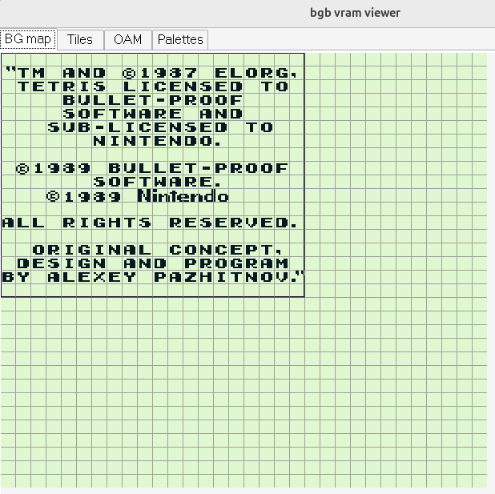
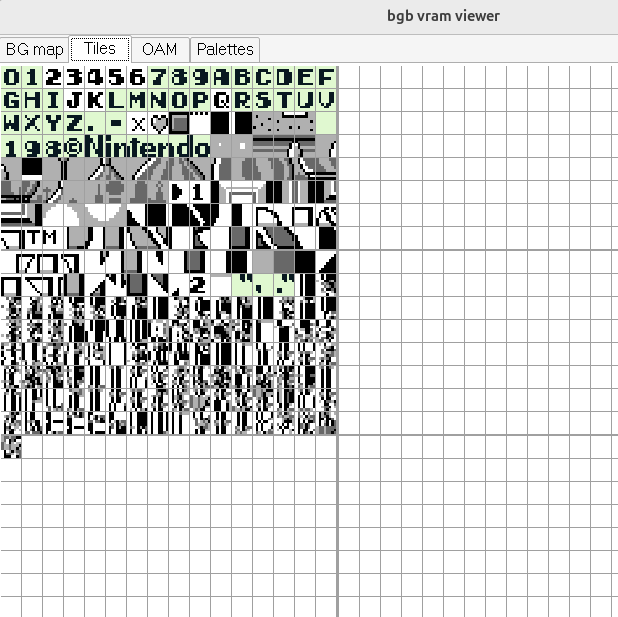

# Text, Input and Metaobjects

## Example: Text in Tetris

## Strings in RGBASM

~~~asm
DB "Hello, world!"
~~~

* a *charmap* (or character map) is a mapping from characters to bytes
* The "character constant" form yields the value
  the character maps to in the current charmap.
* By default, the ASCII code is used (eg, `"A"` yields 65)

## Character Maps

  * When writing text strings, the character encoding in the ROM
    may need to be different than the source file encoding
    * Eg Tetris uses another encoding
  * For example, uppercase letters may be
    placed starting at tile ID 128, which differs from ASCII starting at 65.

Character maps allow mapping strings to arbitrary 8-bit values:

~~~asm
CHARMAP "A", 1
CHARMAP "B", 2
CHARMAP "C", 3
CHARMAP "<heart>", 4 
CHARMAP " ", 5
~~~

  * This would result in `DB "ABC ABC<heart>" being equivalent to
  `DB 1,2,3,5,1,2,3,4`.
  * One `CHARMAP` command is needed for each character.
  * Eg: <https://github.com/pret/pokered/blob/master/constants/charmap.asm#L201>

## Characters in Tetris' ROM

~~~asm
characters:
 DB $00,$3C,$66,$66,$66,$66,$3C,$00 ; 0
 DB $00,$18,$38,$18,$18,$18,$3C,$00 ; 1
 DB $00,$3C,$4E,$0E,$3C,$70,$7E,$00
 DB $00,$7C,$0E,$3C,$0E,$0E,$7C,$00
 DB $00,$3C,$6C,$4C,$4E,$7E,$0C,$00
 DB $00,$7C,$60,$7C,$0E,$4E,$3C,$00
 DB $00,$3C,$60,$7C,$66,$66,$3C,$00
 DB $00,$7E,$06,$0C,$18,$38,$38,$00
 DB $00,$3C,$4E,$3C,$4E,$4E,$3C,$00 ; 8
 DB $00,$3C,$4E,$4E,$3E,$0E,$3C,$00 ; 9
 DB $00,$3C,$4E,$4E,$7E,$4E,$4E,$00 ; A
 DB $00,$7C,$66,$7C,$66,$66,$7C,$00 ; B
 DB $00,$3C,$66,$60,$60,$66,$3C,$00 ; C
 DB $00,$7C,$4E,$4E,$4E,$4E,$7C,$00
 DB $00,$7E,$60,$7C,$60,$60,$7E,$00
 DB $00,$7E,$60,$60,$7C,$60,$60,$00
 DB $00,$3C,$66,$60,$6E,$66,$3E,$00
 DB $00,$46,$46,$7E,$46,$46,$46,$00
 DB $00,$3C,$18,$18,$18,$18,$3C,$00
 DB $00,$1E,$0C,$0C,$6C,$6C,$38,$00
 DB $00,$66,$6C,$78,$78,$6C,$66,$00
 DB $00,$60,$60,$60,$60,$60,$7E,$00
 DB $00,$46,$6E,$7E,$56,$46,$46,$00
 DB $00,$46,$66,$76,$5E,$4E,$46,$00
 DB $00,$3C,$66,$66,$66,$66,$3C,$00
 DB $00,$7C,$66,$66,$7C,$60,$60,$00
 DB $00,$3C,$62,$62,$6A,$64,$3A,$00
 DB $00,$7C,$66,$66,$7C,$68,$66,$00
 DB $00,$3C,$60,$3C,$0E,$4E,$3C,$00
 DB $00,$7E,$18,$18,$18,$18,$18,$00
 DB $00,$46,$46,$46,$46,$4E,$3C,$00
 DB $00,$46,$46,$46,$46,$2C,$18,$00
 DB $00,$46,$46,$56,$7E,$6E,$46,$00
 DB $00,$46,$2C,$18,$38,$64,$42,$00  ; X
 DB $00,$66,$66,$3C,$18,$18,$18,$00  ; Y
 DB $00,$7E,$0E,$1C,$38,$70,$7E,$00  ; Z
 DB $00,$00,$00,$00,$00,$60,$60,$00  ; .
 DB $00,$00,$00,$3C,$3C,$00,$00,$00  ; -
characters_end:
~~~

  * Source: <https://github.com/alexsteb/tetris_disassembly>
  * More text-intensive games have string printing functions
    (eg: Pokemon).
    * Read a string from a memory location, copy it to the current
      background at some location.
  * Tetris does not use any string printing function,
    it just has pre-defined backgrounds.

## Key Input

  * The inputs of the Gameboy are:
    * the directional pad (D-pad) with 4 directions: up, right, down, left
    * 4 more keys: A, B, select, start
    * 8 keys in total
  * We will use a function called `readKeys` to read the
    state of all keys and store it into some 8-bit value.

## Input Function `readKeys`

~~~gnuassembler
;---------------------------------------------------------------------
readKeys:
;---------------------------------------------------------------------
; Output:
; b : raw state:   which keys are currently pressed
; c : rising edge: which keys were newly pressed this frame
; [current] :      same as c, stored in WRAM
; [previous] :     internal state for edge detection (do not touch)
~~~

Variables `previous` and `current` must be declared in WRAM:

~~~gnuassembler
SECTION "Variables", WRAM0
previous: DS 1
current:  DS 1
~~~

In the functions's outputs (`b`,`c` and `current`), the bits correspond to:

down up left right start select B A
---- -- ---- ----- ----- ------ - -
 7   6   5     4     3      2   1 0

## How to use `readKeys` in a Main Loop

1. Call `readKeys` exactly once per frame.
2. Store both outputs if needed later (in a new variable):

~~~gnuassembler
  call readKeys
  ld a,b
  ld [RawKeys],a
~~~

3. Never call `readKeys` twice in a same frame, unless
   you never need the rising edge detection (because it
   would overwrite `[current]`)

A typical main loop would be:

~~~gnuassembler
MainLoop:
  call readKeys
  ; then act accordingly
  call waitVBlank
  call copyShadowOAMtoOAM
  jp MainLoop
~~~

## Note about key mapping

  * We are using regular computers on which we run Game Boy emulators.
  * The keys of the computer keyboard must be mapped.
  * On the `rgbds-live` emulator:
    * keyboard S = game boy A
    * keyboard A = game boy B
    * keyboard right shift = game boy Select
    * keyboard Enter = game boy Start

## Exercise

Download the assembly file [`walkKey.asm`](asm/walkKey.asm).
This is the random walk program with
an introduction screen that waits for a key press before starting the actual
random walk.

The objective of the exercise is to add support for input
as follows:

1. First part:
   * when "A" is pressed, generate new coordinates for
     all objects
   * ensure that to reset again, the "A" key must be released and
     pressed again
   * make sure to check what actual key of your computer is mapped to
     the Gameboy's "A" button
2. Second part:
   * when "B" is pressed, pause the program
   * this requires a `[paused]` variable, initialized at 0.
   * pausing means that objects coordinates are no longer updated on
     each frame
