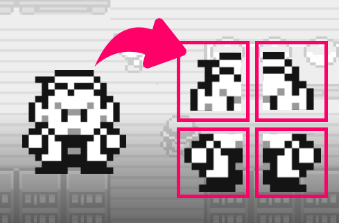
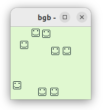
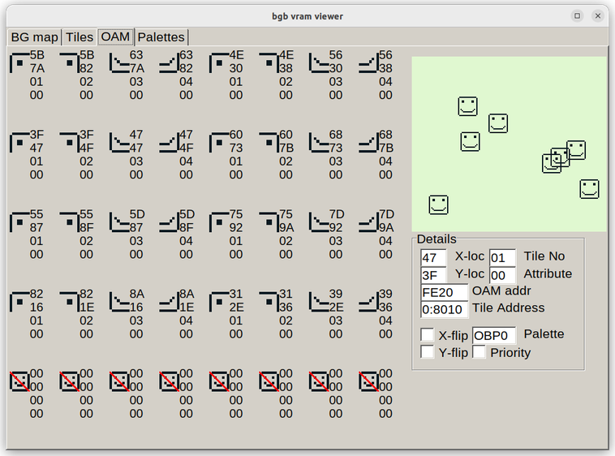

# Metaobjects and Entities States

## What are Metaobjects

* Metaobjects (or metasprites) offer a way to create larger on-screen entities

  * Metaobjects make us separate logic from hardware
  * When designing game entities (like characters), think in two layers:
    1. Logical layer: how the game thinks about the entity. Example: a big character = `(y,x)`
       position in game-world coordinates
    2. Hardware layer: how the game boy handles the entity. Example: 4 sprite objects in OAM,
       each with its own tile and screen position
  * If you only store (Shadow)OAM entries, updating entities is harder.
  * Convert entities to hardware data just before rendering.

## Implementing metaobjects

  * Declare array(s) to store the `(x,y)` coordinates of metaobjects.
  * Apply your program's logic to these metaobjects.
  * To draw these metaobjects on screen, these `(x,y)` coordinates must
    be converted to `(x,y)` coordinates of (`OAM`) objects
  * A function must be written to convert each metaobject's `(x,y)` coordinates
    to several object coordinates in the `ShadowOAM`.
  * In VBlank, copy `ShadowOAM` to `OAM` as usual.

## Exercise: `walkMeta.asm`

* Get the file [`walkMeta.asm`](asm/walkMeta.asm)
* It is another random walk program, but instead of 40 small faces,
  it should have 10 big faces (16x16 pixels), each doing a random walk.
* This is still 40 objects, but they are organized by groups of 4.

Each big face is made of 4 tiles:

~~~gnuassembler
; big face NW corner
 DB %01111111
 DB %10000000
 DB %10000000
 DB %10011000
 DB %10011000
 DB %10000000
 DB %10000000
 DB %10000000
; big face NE corner
 DB %11111110
 DB %00000001
 DB %00000001
 DB %00011001
 DB %00011001
 DB %00000001
 DB %00000001
 DB %00000001
; big face SE corner
 DB %10000000
 DB %10000000
 DB %10100000
 DB %10010000
 DB %10001111
 DB %10000000
 DB %10000000
 DB %01111111
; big face SW corner
 DB %00000001
 DB %00000001
 DB %00000101
 DB %00001001
 DB %11110001
 DB %00000001
 DB %00000001
 DB %11111110
~~~

* Key idea: instead of storing and updating each object's coordinates
  separately, treat metaobjects like first-class citizens
* Use an array to store the `(y,x)` coordinates of each metaobject:

~~~gnuassembler
DEF METAOBJCOUNT EQU 10

SECTION "Variables", WRAM0
MetaCoord: DS 20
ShadowOAM: DS 160
~~~

<!--
Here is the VRAM viewer of the BGB emulator:

-->

* Get the [`walkMeta.asm`](asm/walkMeta.asm) file.
* Search each `TODO` and complete the missing code.
* If time allows, complete the stretch goals.

## Deliverables

* `walkKey.asm`
* `walkMeta.asm`

## Objects with States: `smoothWalk.asm`

Download [`smoothWalk_TODO.asm`](asm/smoothwalk_TODO.asm),
a random walk program with a reset key if you press A.
You can also run the `.gb` file to see the desired behaviour.

* Each object can be in 5 states: 

~~~asm
DEF IDLE   EQU 0
DEF UP     EQU 1
DEF RIGHT  EQU 2
DEF DOWN   EQU 3
DEF LEFT   EQU 4
~~~

* `IDLE` is the only non-moving state; when moving, an object has as certain amount
  of steps to go in the same direction until coming back to `IDLE` state.

* The coordinates and the states of each object are stored in the following array
  that can accomodate up to 40 objects:

~~~asm
Coordinates: DS 80 ; (y,x)
States: DS 80 ; (STATE, COUNTER)
~~~

* The `UpdateObjects` function must fulfill the following description:

~~~asm
UpdateObjects:
; when idle:
; * 1/16 probability: choose direction (among 4), choose counter (4..16)
; * otherwise stay idle
; when non idle:
;  * move object along chose direction, decrement counter
;  * if counter == 0, set object to idle
~~~  

* Main loop structure:

~~~asm
MainLoop:
  call readKeys
  call MaybeReset
  call UpdateObjects    ; modify the arrays Coordinates and States only
  call UpdateShadowOAM
  call WaitVBlank
  call CopyShadowOAMtoOAM
  jp MainLoop
~~~

Fill in the missing implementation of `UpdateObjects`.

## Deliverables

* `smoothWalk.asm`
