# Advanced Assembly: Constants, Macros, Lookup Tables

## Constants (`EQU`)

* `EQU` is used to define numeric constant symbols.
* Constants defined this way cannot be redefined.
* These constants can be used for unchanging values such as properties of the hardware.

~~~asm
def SCREEN_WIDTH  equ 160 ; in pixels
def SCREEN_HEIGHT equ 144
~~~

## Repeating Blocks of Code

Everything between `REPT` and the matching `ENDR` will be repeated a number
of times just as if you had done a copy/paste operation yourself. The
following example will assemble `add c` four times:

~~~asm
REPT 4
    add c
ENDR
~~~

## Macros

Syntax:

~~~
MACRO MacroName
  bla
ENDM
~~~

Now every time you use `MacroName`, it will be expanded into the
definition of the macro.

Example:

~~~
MACRO LD_HL_DE
  ld h,d
  ld l,e
ENDM

  ...

  LD_HL_DE
  ld de, $1234
~~~

## Macros with labels

Macros are simple text substitution. They do not create new labels.

Suppose your macro expands to a loop of assembly code:

~~~
MACRO loop_c_times
    xor a
.loop
    ld [hl+], a
    dec c
    jr nz, .loop
ENDM
~~~

If you use this macro more than once in the same label scope, it will define
`.loop` twice, which is an error. To work around this problem, you can use
`\@` as a label suffix:

~~~
MACRO loop_c_times_fixed
    xor a, a
.loop\@
    ld [hl+], a
    dec c
    jr nz, .loop\@
ENDM
~~~

This will expand to a different value in each use of the macro.

## Macros with arguments

* Macros do not need to declare how many arguments they have.
* Inside the macro body, `\1` is the first argument, `\2` the second, etc.

~~~
; Example
MACRO SET_MEM
    ld a, \2      ; \2 is the second argument
    ld [\1], a    ; \1 is the first argument
ENDM
~~~

~~~
; Usage
 SET_MEM TILEMAP0, 5
 SET_MEM TILEMAP0+1, 10
~~~

## Macros versus Functions

* `call` + `ret` is 4 bytes and 40 cycles.
* Can functions always be replaced by macros?
* Only possible for functions that have a single `ret`.
* It does not make sense for conditional calls.
* It is not common practice, except for very short functions such as:

~~~
MACRO WaitVblank
.loop\@
  ld a,[rLY]
  cp 144
  jr nz, .loop\@
ENDM
~~~

Another option, the simple random number generator:

~~~
MACRO RandomByte
  ld a,[rDIV]
  xor b
  xor l
  xor [hl]
ENDM
~~~

Macros are allowed to be used in the project.

## Lookup Table Exercise

The objective is to reproduce the following program:

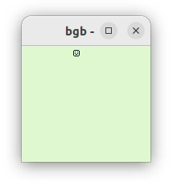{width="3cm"}
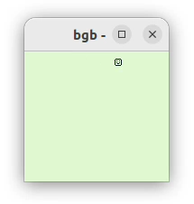{width="3cm"}
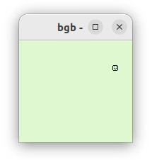{width="3cm"}
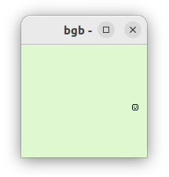{width="3cm"}
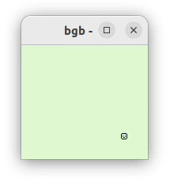{width="3cm"}
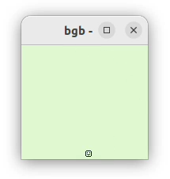{width="3cm"}

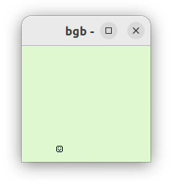{width="3cm"}
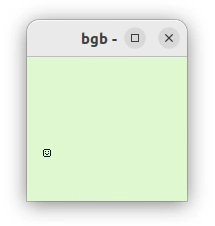{width="3cm"}
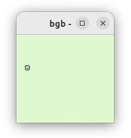{width="3cm"}
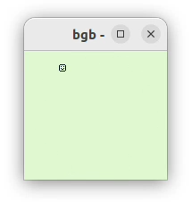{width="3cm"}
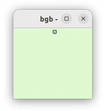{width="3cm"}
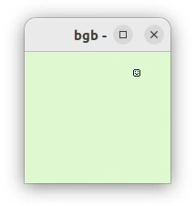{width="3cm"}

This program shows a single object moving into a circle trajectory.

The object's state is represented by an angle, stored as a single byte
variable, whose range is 0 to 255.

Its `(y,x)` coordinates calculated from its angle, thanks to two
lookup tables `yLUT` and `xLUT`.

These lookup tables are generated by a separate C program that uses the
standard `sin` and `cos` functions from `math.h`.

Task:

1. The C program [`genLut.c`](asm/lut/genLut.c) is provided for you to complete.
   This program must be completed and run by you to generate the two lookup
   tables, that should be written into a new file `tables.inc`.
2. In the program [`circle.asm`](asm/lut/circle.asm), implement the functions
   that contain a `TODO` comment (once the functions are implemented you
   cam remove the `TODO` line).
3. Implement a pause feature. By default, the object moves.
   When the user presses the A key, the program goes in pause mode, in which the movement stops.
   Pressing the A key toggles between pause mode and normal mode.

## Deliverables

* `circle.asm`
* `genLut.c`
