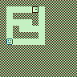

# Building Games

## Topics of this Section

* From Random Walk to a Game
* Tilemaps in WRAM
* Loading levels from ROM
* Converting (x,y) coordinates to tile addresses
* Collision detection
* Game states

## From Random Walk to a Game

The random walk program updates object coordinates every frame:

~~~gnuassembly
MainLoop:
  call UpdateObjects
  call WaitVBlank
  call CopyShadowOAMtoOAM
  jp MainLoop
~~~

Now, most games follow a similar structure:

~~~gnuassembly
MainLoop:
  call ReadKeys
  call UpdateGame
  call WaitVBlank
  call RenderGame
  jp MainLoop
~~~

The current state of the game is stored in memory variables,
such as:

* map contents
* player coordinates
* current level
* score
* number of lives

## Mini-Project: Maze

Today we will build a small maze game:

{width="6cm"}

The player moves inside a maze using the direction keys.
The objective is to reach the exit tile.

The game is simple, but introduces several
techniques that are useful for the final project:

* level representation
* collisions
* level loading
* level progression
* game states

## Tiles

The following tile values are used:

~~~
0 = Empty
1 = Wall
2 = Exit
3 = Player start
~~~

The player start tile is only used in the level data.
Once the level is loaded, the player's coordinates are
stored in variables.

## Level Representation

Levels are stored in ROM as a 6×6 grid.

Example:

~~~asm
Level1:
db 0,0,0,0,2,0
db 0,1,1,1,1,0
db 0,0,0,0,1,0
db 0,1,0,0,0,0
db 0,1,1,1,1,0
db 3,0,0,0,0,0
~~~

To simplify collision handling, levels are copied into an
8×8 map in WRAM, and the outer border is automatically
filled with walls.

The resulting map becomes:

~~~
########
#....E.#
#.####.#
#....#.#
#.#....#
#.####.#
#......#
########
~~~

## Variables

~~~asm
SECTION "Variables", WRAM0

MapData:     DS 64 ; 8x8 tilemap
PlayerX:     DS 1
PlayerY:     DS 1

CurrentLevel: DS 1
GameState:    DS 1
~~~

## Coordinate Conversion

The address in memory of tile `(x,y)` is:

~~~
MapData + y*8 + x
~~~

Because the width is 8, multiplication can be implemented
with three left shifts.

## Exercise 1: Prevent Walking Through Walls

Modify `UpdateGame` so that movement is cancelled when the destination
tile contains a wall.

Hint: implement and use a function `GetTile`

~~~gnuassembler
; input:
;   B = Y
;   C = X
;
; output:
;   A = tile value
GetTile:
  ; TODO
  ret
~~~

## Exercise 2: Detect the Exit and Load Next Level

After a successful move, check whether the player is standing on an exit tile.
When the player reaches the exit, load the next level and redraw the map.
Use the `currentLevel` variable. Add a third level and test your game.
Be careful with the stack pointer; it should not drift every time you load a new level.

## State Variables

A program often needs to remember which mode it is currently in.

Examples:

* title screen
* gameplay
* ending screen

A variable can be used for this purpose:

~~~gnuassembler
SECTION "Variables", WRAM0

gameState: DS 1
~~~

Constants:

~~~gnuassembler
DEF STATE_TITLE  EQU 0
DEF STATE_PLAY   EQU 1
DEF STATE_ENDING EQU 2
~~~

Changing state:

~~~gnuassembler
  ld a,STATE_PLAY
  ld [gameState],a
~~~

## State Dispatch

A common technique is to execute different code depending on the value
of a state variable.

~~~gnuassembly
DispatchState:
  ld a,[gameState]

  cp STATE_TITLE
  jp z,StateTitle

  cp STATE_PLAY
  jp z,StatePlay

  cp STATE_ENDING
  jp z,StateEnding

  ret
~~~

Main loop:

~~~gnuassembly
MainLoop:
  call ReadKeys
  call DispatchState
  call WaitVBlank
  call RenderGame
  jp MainLoop
~~~

This technique is optional, but often helps organize games containing
multiple screens or modes.

## Exercise 3: Implement Title Screen and Win Screen

Include text tiles from Tetris to print a "WELCOME" and "YOU WIN"
messages in both screens.

It is not necessary to use state variables yet.

## Exercise 4: Implement player animation.

When the player moves, game goes into an animation state where the
player object moves smoothly to the next position.

## Deliverable

Edit the provided file [`maze.asm`](asm/maze.asm).

